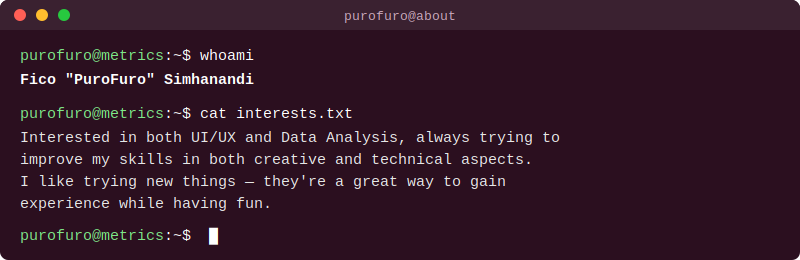

# Welcome! I'm PuroFuro

## Tools I've used and learned  

## How to reach me

## My Portfolio

<picture>
  <source media="(prefers-color-scheme: dark)" srcset="https://pixel-profile.vercel.app/api/github-stats?username=PuroFuro&theme=road_trip&pixelate_avatar=false">
  <source media="(prefers-color-scheme: light)" srcset="https://pixel-profile.vercel.app/api/github-stats?username=PuroFuro&theme=summer&pixelate_avatar=false">
  
</picture>